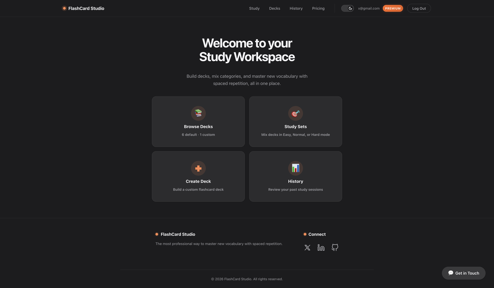

<div align="center">
  <h1>FlashCard Studio 🧠</h1>
  <p><strong>The most professional way to master new vocabulary with spaced repetition.</strong></p>
</div>

<br />

<!-- 📸 Add your project screenshot below -->
<!-- Replace the path with your actual screenshot file -->
<div align="center">
  
</div>

<br />

FlashCard Studio is a modern SaaS flashcard app built with React 19 and Supabase. It features a freemium model, VietQR payment integration, and a polished dark/light theme system.

## Features

- 🔐 **Authentication** — Login, signup, password recovery via Supabase Auth
- 🧠 **Spaced Repetition** — Study modes (Easy, Normal, Hard) with mixed deck shuffling
- 💳 **Premium Plan** — VietQR checkout, plan upgrade/downgrade, gated features
- 📦 **Custom Decks** — Create, edit, delete decks with emoji icons
- 📊 **Practice History** — Track scores and sessions (Premium-only)
- 🌗 **Dark / Light Theme** — Smooth toggle with CSS variable design system
- 📱 **Responsive** — Optimized for desktop and mobile

## Tech Stack

| Layer     | Technology                          |
|-----------|-------------------------------------|
| Framework | React 19 + Vite 8                   |
| Styling   | Vanilla CSS (Variables, Grid, Flex) |
| Backend   | Supabase (Auth, PostgreSQL, RPC)    |
| Payments  | VietQR Quick Link API               |
| Icons     | Emoji Mart                          |

## Project Structure

```text
src/
├── App.jsx                    # Root component & routing
├── main.jsx                   # Entry point
├── assets/styles/             # Design tokens, global styles, themes
├── components/
│   ├── layout/                # Navbar, Footer
│   └── shared/                # Modals, PremiumUpsell, ProtectedRoute
├── features/
│   ├── auth/                  # Login, Signup, ForgotPass, ResetPass
│   ├── decks/                 # DeckSelect, CreateDeck, EditDeck, StudySets
│   ├── history/               # Practice history (Premium)
│   ├── home/                  # Dashboard
│   ├── payment/               # VietQR checkout modal
│   ├── pricing/               # Plan comparison & downgrade
│   └── study/                 # Flashcard, AnswerCheck, Results, Session
├── hooks/                     # useAuth, useDecks, useFlashCards, useHistory, useTheme
└── services/                  # Supabase client, payment service
```

## Getting Started

1. **Clone & install:**
   ```bash
   git clone https://github.com/TrgSonVu33/Flash_Card_React_App.git
   cd Flash_Card_React_App
   npm install
   ```

2. **Set up environment:**
   Copy `.env.example` → `.env` and add your Supabase credentials:
   ```env
   VITE_SUPABASE_URL=your_supabase_project_url
   VITE_SUPABASE_ANON_KEY=your_supabase_anon_key
   ```

3. **Run:**
   ```bash
   npm run dev
   ```

## Scripts

| Command           | Description                        |
|-------------------|------------------------------------|
| `npm run dev`     | Start dev server with HMR          |
| `npm run build`   | Build for production → `dist/`     |
| `npm run preview` | Preview production build locally   |
| `npm run lint`    | Run ESLint checks                  |

## License

MIT
